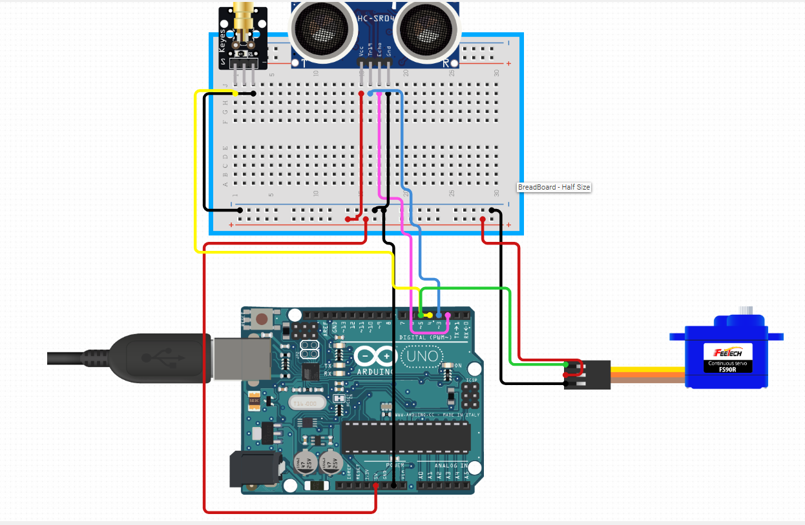
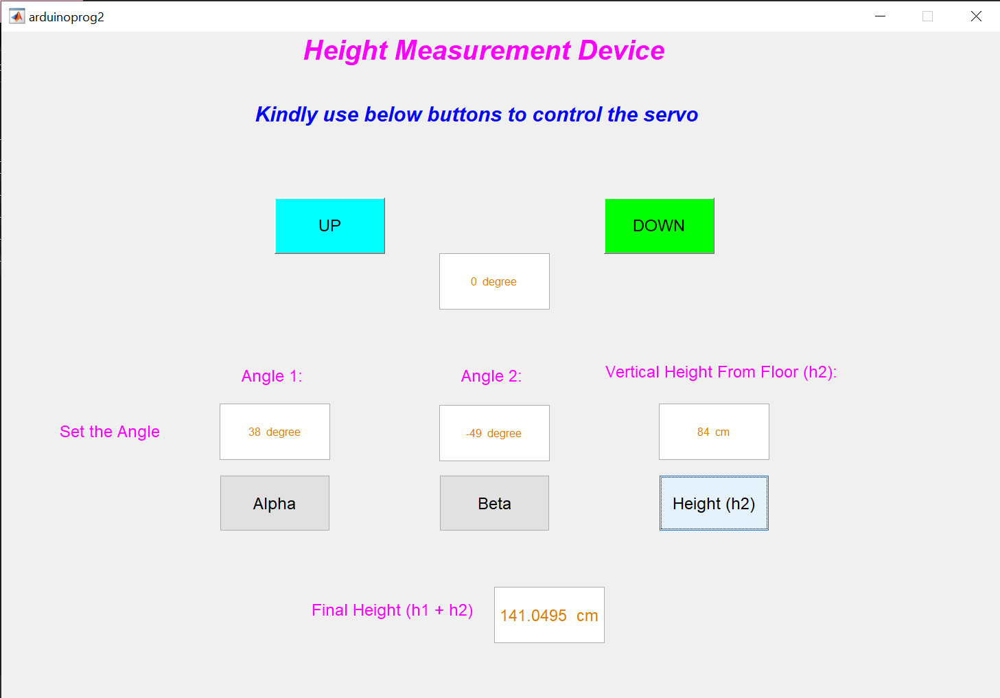

# Inclinometer
Its a working model to measure height using adrunino, servos and MATLAB
<h1>Introduction</h1>

Measuring height of an object using trigonometry is one of the basic applications of mathematical modelling. But it's so crucial that almost every electronic device we see today rely on trigonometric formulas for the measurement. And height is an important feature of any living or non-living being which can be used to describe its nature. For instance, scientists studying a forest ecosystem over a long period of time may record measurements of trees for a number of variables, including each tree's diameter at breast height, height of the lowest living branch, canopy cover, etc. One aspect of a tree's growth that can be hard to measure is tree height. Forest researchers sometimes use a piece of equipment consisting of telescoping components, which are extended until the tip reaches the same height as the tree top (this requires a second researcher standing at a distance from the tree to determine when the tip is at the correct height). This method can be cumbersome, as the equipment is bulky and the measurements require two people. 
It is necessary because the measurement of tree growth in a forest over time provides important information about the dynamics of that ecosystem. Growth rates can reflect, among other things, differing availability of water, carbohydrates, or nutrients in different sites or from season to season or year to year. 
Therefore, the project aims at creating an electronic model that can be used to approximate the height of an object in a visible range. 

<h1>Methodology</h1>
<h2>Setup of the system</h2>
<figure style="text-align: center;">
    
    <figcaption>Figure 1. Diagram of the setup for height measurement</figcaption>
</figure>

<h2>Instruments in the circuit</h2>
<figure style="text-align: center;">
    
    <figcaption>Figure 2. Circuit diagram for the arduino and sensors connection</figcaption>
</figure>

<h2>Steps to install the software and operate the MATLAB GUI:</h2>

<ol>
  <li>Install Code Inside Arduino: This will allow it to understand the signals to be received from MATLAB UI and also helps arduino to power and  control  the sensors to perform the task of height measurement.
To install code in arduino, upload the code mentioned in Appendix section 1 from Arduino Compiler into arduino board. By default the arduino board is connected at COM PORT 3 i.e COM3. This can be changed whenever the port is not available for use by going inside the device attached section of the windows system. 
</li>
  <li>Once the code gets installed, now it's turn to open the MATLAB GUI to  measure the angles and control the sensors. To open the MATLAB GUI run the code mentioned in Appendix section 2. After execution of the code the command line will ask the COM PORT to which it needs to get connected to send and receive signals from. 
Type ‘COM3’ to signify the COM PORT 3 to which arduino has connected by default.
</li>
  <li>Once you have entered the COM PORT name it will open the MATLAB GUI as shown in the figure 3.</li>
   <li>By Default the servo will align horizontally to signify zero or the starting point as soon as the MATLAB GUI will open. 
The MATLAB UI consists of two buttons, ‘UP’ and ‘DOWN’. The ‘UP’ button will allow the signal arduino to move the servo motor shaft in the upward direction. The lazer attached to the shaft of the servo will also move and will keep pointing on the object. The ‘User’ needs to keep pressing the upward button to point the laser to the top most point on the object.
</li>
<li>
  Once the lazer points to the top most position on the object press the ‘Alpha’ button to record the angle value. 
As soon as you record the alpha angle value, the servo will again align automatically to horizontal zero position.

</li>
<li>Similarly, press the ‘DOWN’ button to measure the ‘Beta’ angle value. Keep moving the servo motor shaft downward until the lazers point at the bottom most point of the object. 
</li>
<li>
Once it reaches the bottom most point press the ‘Beta’ button to record the beta angle value.
</li>
<li>
 Now we need to get the last sensor value i.e height ‘h1’ from the hypersonic sensor  HC SR04. Press the ‘Height (h2)’ button to get the height h1 measured by the sensor. The sensor will send ultrasonic sound on the floor and receive it back to measure the time taken by the sound signal to reach back and measure the distance from floor.

</li>
 <li>
     Once this distance is recorded the height will be calculated according to the below formulation coded in MATLAB.  
     <ol>
       <li>First it will calculate Base (B1) : Base(B1) = h1/tan(&beta;)
</li>
       <li>Then, we calculate  Height (h2) : h2 = tan(&alpha;) * B1</li>
       <li>The Total height (H) : H=h1 +h2</li>
     </ol>
 </li>
 <li>
    And the final height result is shown in the final height (h1 +h2 ) box in the GUI.
  </li>
</ol> 
<figure style="text-align: center;">
    
    <figcaption>Figure 3. MATLAB GUI built to record sensor values and to give commands to arduino for height measurement</figcaption>
</figure>

<h1>Results</h1>

We tested the device to measure heights of some of the basic instruments which are recorded in table 1. We measured the heights of three different objects of variable height to demonstrate the methodology and workability of the instrument built. 
We first measured the height of a 'Shoe Rack' which was 135 cm in height measured using a centimeter scale. After calculating the angles alpha and beta and the height (h1) we got the approximate height (h1 +h2) equal to 141.0495 cm. The deviation from actual height was around 6.95 cm more than the actual height.
Second object we used is a wall of height 300 cm. The measured height using the instrument was 296.0658 cm with only 3.9342 cm less than the actual height of the wall.
The third object we used is a 'Cupboard' which was of 200 cm height. The measured height was 196.4411 cm and the error in height was 3.5589 less than the actual height.
On an average the difference between actual and predicted height error was around 4.53 cm.

<table>
  <tr>
    <th>Sno</th>
    <th>Object</th>
    <th>Actual Height</th>
    <th>Alpha(&alpha;)</th>
    <th>Beta(&beta;)</th>
    <th>Height(h1)</th>
    <th>Total Height calculated</th>
  </tr>
  <tr>
    <td>1</td>
    <td>Shoe Rack</td>
    <td>135 cm</td>
    <td>38 degree</td>
    <td>49 degree</td>
    <td>84 cm</td>
    <td>141.0495 cm</td>
    
  </tr>
  <tr>
    <td>2</td>
    <td>Wall</td>
    <td>300 cm</td>
    <td>71 degree</td>
    <td>49 degree</td>
    <td>84 cm</td>
    <td>296.0658 cm</td>
  </tr>
    <tr>
    <td>3</td>
    <td>Cupboard</td>
    <td>200 cm</td>
    <td>57 degree</td>
    <td>49 degree</td>
    <td>84 cm</td>
    <td>196.4411 cm</td>
  </tr>
  </table>

<h1>Conclusion</h1>
The project successfully demonstrates the creation of a height measurement device which utilises simple sensors and MATLAB software. On an average the difference between actual and predicted height error was around 4.53 cm measured by the built device. The device can be used to measure the height of the instrument in the visible range of the lazer. Using the module demonstrated in the project we can measure the height of any object in theoretical terms. But due to limitations of the sensor's range and human involvement it is not feasible to measure all the objects using this device. 

<h2>Limitations:</h2>
<ol>
<li>The ultrasonic sensor can measure the maximum range of 4 m and therefore it can’t be placed at higher height on the stand. </li>
<li>The transmission of signal from MATLAB to arduino for the rotation of servo is also has some delays due to which there is a delay in response time</li>
<li>Manual errors created due to human involvement also degrades precision value</li>
<li>The angles calculated using servo motors are also not precise to give the exact value of the angles.</li>

</ol>

<h2>Improvements that can be made </h2>
<ol>
<li>In order to improve the mechanism, we need to use servos that can measure the angles at a high precision rate such as an ‘Inclinometer’.</li>
<li>To reduce manual error the system must be made automated such that it should be able to scan the object automatically to measure the alpha and beta angle more accurately. Since humans will always have difficulty in maintaining the correct position of the laser therefore the device should be autonomous in calculating the angles.</li>
<li>The devices and sensors should be fixed properly so that there should be no error due to manufacturing issues. For instance, the laser that we used was not aligned properly. It was tilted at an unknown angle from its position. This error can only be rectified if we can use high quality sensor devices with no manufacturing defects.</li>
</ol>

